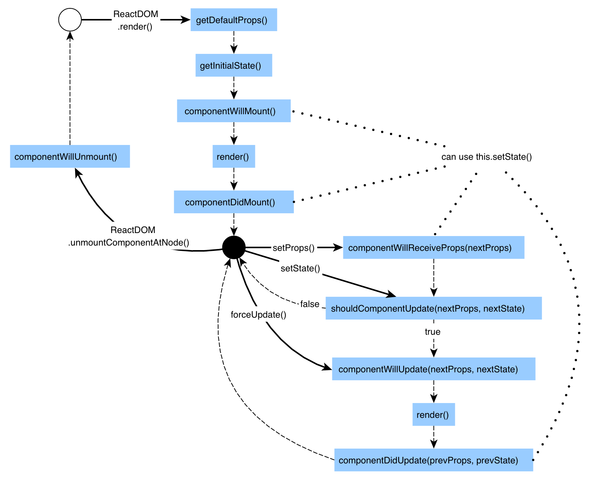

# React Fundamentals Course - Notes

### React Component Based
```jsx
// Examples
// Example 1
class HelloUser extends React.Component {
  render() {
    return (
      <div> Hello, {this.props.name}</div>
    )
  }
}
ReactDOM.render(<HelloUser name="Tyler"/>, document.getElementById('app'));

// Example 2
<ProfilePic />

var ProfilePic = function(){
    return(
        <a href={this.props.name}></a>
    )
}
```

### Imperative vs Declarative Paradigm
```jsx
// Imperative (How) => like a normal loop
for(var i = 0; i < numbers.length; i++){
    total += numbers[i];
}
// Declarative (What) =>
// There is a lot of abstraction in here
numbers.reduce(function(previous,current){
    return previous + current
})
```

* Imperative: C, C++, Java
* Declarative: SQL, HTML

### Unidirectional Data Flow
```jsx
this.setState({
    highlight: !this.state.highlight,
})
```

#### Reduce is pretty cool

```jsx
var sum = [0, 1, 2, 3].reduce(function (a, b) {
  return a + b;
}, 0);
```

### Modules and Webpack
```bash
npm install somePackage # install locally
npm install somePackage --save # saves it to the package.json too so it's generated when running npm install
```

* On webpack.config.js
```javascript
module.exports = {
    // entry point
  entry: './app/index.js',
  module: {
    rules: [
        // regex to modify all .coffee extensions
      { test: /\.coffee$/, use: "coffee-loader" }
    ]
  },
  output: {
      // where to output the files
    path: path.resolve(__dirname, 'dist'),
    filename: 'index_bundle.js'
  },
  plugins: [
    new HtmlWebpackPlugin({
      template: 'app/index.html'
    })
  ]
}
```

### Pass props as an object
 
* `We should treat props passed to a component as inmutable` 

```jsx
<Badge user={USER_DATA}/>

// Then to access it we use
this.props.user.something

// We can pass props in a cascading effect
// the order is opposite from bottom to top
<Badge user={
    name: 'Tyler McGinnis',
} />

class Badge extends React.Component {
  render() {
    return (
      <div>
        <Label name={this.props.user.name}/>
      </div>
    )
  }
}

class Label extends React.Component {
  render() {
    return (
      <h1>Name: {this.props.name}</h1>
    )
  }
}
```

### .map() & .filter() 🔥
```jsx
// .map() goes through the whole array like a for loop
// Example
var numbers = [1,2,3];
var numbersPlusTen = numbers.map(function (num) {
  return num + 10
});
//or
var numberPlusTen = numbers.map( (num) => num+10 );

// .filter() does the same but filters the condition out and returns it
var friends = ['Ean', 'Tyler', 'Mikenzi', 'Eric', 'Jessica'];
var newFriends = friends.filter( (friend) => { friend[0] === 'E'});
console.log(newFriends) // ['Ean', 'Eric']
// Filters out everything starting with 'E'

// Combined with ES6
{this.props.list.filter((user) => user.friend == true).map((user) => <li>{user.name}</li>)}

// Combined very bad with ES5
{this.props.list
  .filter(function(user){
            return user.friend == true;
          })
  .map(function(user){
        return <li>{user.name}</li>
        })
}
```

* Remember to pass the key to every list-item as a unique identifier
```jsx
  return <li key={user.name}>{user.name}</li>
```

### Pure Functions and Function Composition
```jsx
var getProfileLink = function (username) {
  return 'https://www.fb.com/' + username
}

var getProfileData = function (username) {
  return {
    link: getProfileLink(username)
  }
}

getProfileData('tylermcginnis')

// we can modify this to React 
 class ProfileLink extends React.Component {
   render() {
     return (
       <a href={'https://www.fb.com/' + this.props.username}>
         {this.props.username}
       </a>
     )
   }
 })

 class Avatar extends React.Component {
   render() {
     return (
       <div>
         <ProfileLink username={this.props.username} />
       </div>
     )
   }
 })

 <Avatar username="tylermcginnis" />
```

* Slice and Splice
```jsx
var friends = ['Ryan', 'Michael', 'Dan']
// Slice return from posiiton 0 to 1
.slice(0,1)  // 'Ryan'
.slice(0,1)  // 'Ryan'

// Splice returns from position 0 to 1 but pulls the item too
.splice(0,1) // 'Ryan'
.splice(0,1) // 'Michael'
``` 

### PropTypes
```jsx
// require
var PropTypes = require('prop-types');

// class
Class Users extends React.Component{ /**/ }

// check props 
Users.propTypes = {
  list: PropTypes.array.isRequired,
  img: PropTypes.string.isRequired,
  // more specific
  friends : PropTypes.arrayOf(PropTypes.object)
  // inside an array of objects
  morefriends : PropTypes.arrayOf(PropTypes.shape({
    name: PropTypes.string.isRequired,
    friend: PropTypes.bool.isRequired
  }))
}
```

### The 'this' keyword
```jsx
// Implicit Binding
ale.callName()
callName(){return this.name}

// Explicit Binding
sayName.call()
sayName.apply()
sayName.bind()

// .bind() binds a function with their arguments to another function
let newFunction = sayName.bind(...arguments)

// new and windows binding
// windows.binding is when 
```

### Managing and updating Component State
=> Tutorial

* With arrow function you don't need to pass to .map() a second argument .this because it already binds

```jsx
// Explicit bound
// New function where this function is bind to this keyword
this.updateLanguage = this.updateLanguage.bind(this);
// make the this inside the updateLanguage() is bound to the state

onClick={this.updateLanguage.bind(null, lang)}
```

### Stateless Functional Components
```jsx
function HelloWorld (props) {
  return (
    <div>Hello {props.name}</div>
  )
}
ReactDOM.render(<HelloWorld name='Tyler' />, document.getElementById('app'))
```

### Life Cycle Events


### 